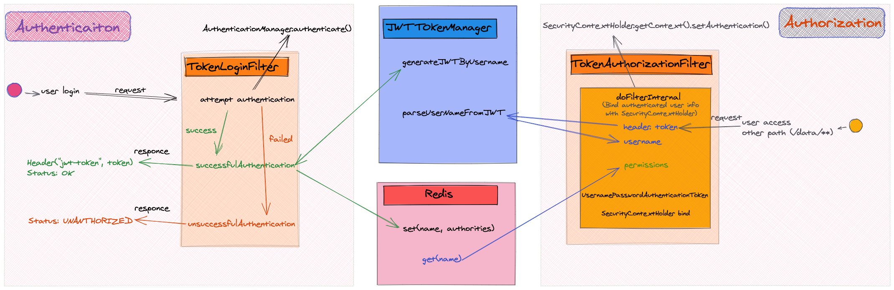

在Spring security基础上增加了自定义MD5密码加密，使用了JWTtoken，增加在request的header中，并应用redis缓存用户权限。  

#logs:
Time: 2021-12-08  
Title: security practice v1 version  
Content: 这只是一个Gradle+Springboot+Spring Security的伪代码，未必可以成功运行起来哈

The detail flowchart is followed:

